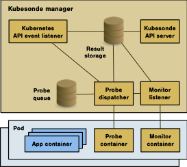

[](https://app.netlify.com/sites/kubesonde/deploys)


# Kubesonde

Kubesonde is a tool to probe and test network security policies in a Kubernetes.



## Structure of the project
Folders are organised as follows: 
- `crd`: backend service and kubesonde CRD 
- `docs`: documentation of the project/ideas.
- `frontend`: contains the UI for analysing the probe outputs
- `examples`: sample output from Kubesonde

## Run Kubesonde
### 1. Start the kubernetes engine

You can run kubernetes on the cloud, bare-metal or via minikube or kind.
### 2. Install the app to test

Install the application you want to test (e.g., `helm install wordpress bitnami/wordpress`). Make sure that the app is running with no errors.

### 3. Install Kubesonde

To install kubesonde run `kubectl apply -f kubesonde.yaml`. This creates all the required resources to run kubesonde on your cluster. After that, you can install a scanner object for kubesonde. An example one, targeting only the default namespace is available. Then, you can create a Kubesonde object, for instance: 
```yaml
apiVersion: security.kubesonde.io/v1
kind: Kubesonde
metadata:
  name: kubesonde-sample
spec:
  namespace: default
```
### 4. Fetching the results

To fetch the results, you need to use the following commands:

`kubectl --namespace kubesonde port-forward deployment.apps/kubesonde-controller-manager 2709`. This command creates a port mapping between your local computer and the kubesonde deployment.

`curl localhost:2709/probes > <output-file>.json`. This command gets the probe result and stores it to an output file.

### 5. View results

Navigate to the [current kubesonde website](https://testksonde.netlify.app/) and upload the generated file to see the results.
 
## Credits

Logo from [Elisabetta Russo](stelladigitale.it) info@stelladigitale.it